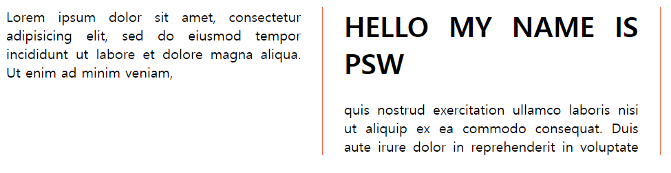
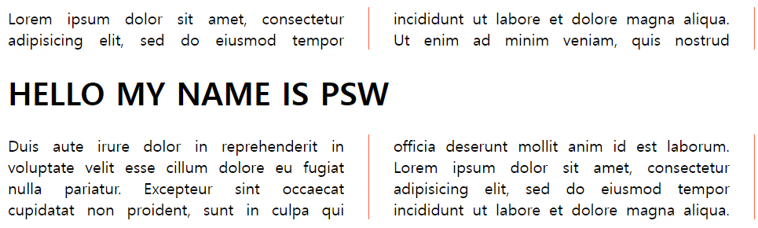

#### 1. .column의 글을 2단으로 나누어 보여준다
```css
.column{
    text-align: justify;
    column-count: 2;
}
```


#### 2. .colmn의 글을 200px씩 잘라 보여준다. 이때, 200px은 단 width의 최소값이다
예를 들어 창의 가로 크기가 500px일 경우 200px*3으로 나눌 수 없으므로, 250px크기의 2개 단이 생긴다

```css
.column{
    text-align: justify;
    column-width: 200px;
}
```


#### 3. .column의 단 최대 개수는 4개, width 최소값은 200px이 된다

```css
.column{
    text-align: justify;
    column-count: 4;
    column-width: 200px;
}
```


#### 4. column 사이 여백 조정 : 사이 여백의 크기가 50px이 된다

```css
column-gap: 50px;
```


#### 5. 글 사이에 제목이 들어가는 경우

아래와 같이 컬럼 안에 제목이 갇히게 되는데, 이를 해결하려면 해당 구역을 선택하여 column-span을 all로 설정하면 된다




```css
h1{
    column-span: all;
}
```



#### 6. 핀터레스트 스타일 레이아웃